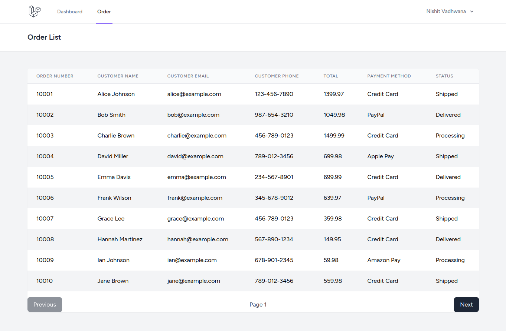

# Laravel Vue Order Management App
This is a simple Laravel Breeze and Vue application that already has some built-in features. I have added functionality to import orders through a command and display them with pagination in the application.

Reference: [starter-kits](https://laravel.com/docs/11.x/starter-kits#breeze-and-inertia)

We are going to import orders JSON into this application and then render a page for listing orders.

## Installation
1. Clone this repository.
2. Run `composer install` to install laravel dependencies.
3. Run `npm install` to install node dependencies.
4. Copy `.env.example` to `.env` and configure database details. Make sure, you created new database.
5. To generate application key, execute `php artisan key:generate`.
6. Run all migrations `php artisan migrate`.
7. Run inbuild command `php artisan app:process-orders` to import orders from json file. It will show message after it ran.
8. Please do run these 2 commands in different tabs to start the application. Keep them running please.

Running Node
`npm run dev`

Running Laravel
`php artisan serve`
You will get local end point to access this application.
Like: `http://127.0.0.1:8000/`. Open it and you will see laravel page. 


9. Click on Register link and register your self. `http://127.0.0.1:8000/register`
10. Open login page. `http://127.0.0.1:8000/login`
11. After logged in, you can see 2 menu items on the top. One is Dashboard and another is Order.
12. Click on Order page, you will have the list of order details.



## API Reference

#### Get all orders

```http
  GET /api/orders
```

| Parameter | Type     | Description                |
| :-------- | :------- | :------------------------- |
| `page` | `integer` | **Required**. Default is 1 |


### Additional Notes
This is a learning curve, and there's a lot that can be done with the implemented code:

- Implement filters in the order list.
- Create a reusable table component for all lists.
- Enhance the user experience with improved pagination.
- Integrate search and sorting features.

Feel free to explore and modify the code to meet your specific requirements!"